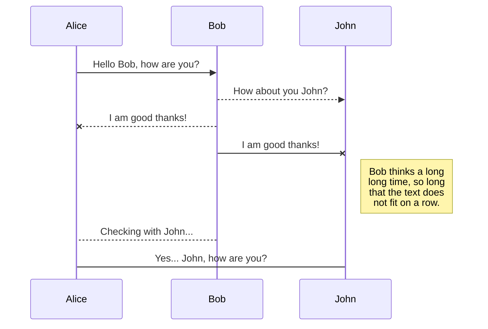
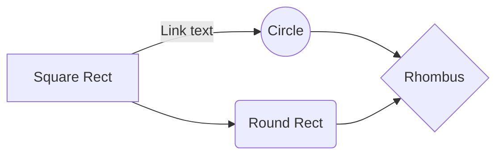

# OpenRE 

## Open Source Real Estate Sales & Marketing Solution
- Lead Generation Websites • CRM • Lead Cultivation • Marketing
- lead databases with marketing automation features and real-time reporting / analytics.

### Mission and Values
#### Mission
>We are on a mission to enable communities to be sustainable and fundraise in full transparency without having to create a legal entity to do so. 
>Values 
>Sustainability: We can’t achieve our mission unless we are sustainable doing it. We take a broad definition of sustainability as financial, collective and individual >sustainability.
>Openness: We work in the open, use public slack, our code is public. We strive to be reachable and welcoming.
>Resilience (people come and go) A successful company survives its founders. We try to do things in a way anyone can pick up after and carry on.
>Transparency: Our  is public as well as , our investor's update is regularly published  and our salary tiers are published.

#### Facebook Marketing Tool
Simplifies and accelerates the ad creation process and tracks performance.
A quick & easy solution to creating Facebook ads that drive traffic to high-converting landing pages

[real geeks facebook marketing tool](https://www.realgeeks.com/facebook-marketing-tool/)

#### Facebook Marketing Service
In-house marketing team offers managed Facebook marketing tailored to the client's market to generate leads for their real estate business.

#### Property Valuation Tool
"What is Your Home Worth" property valuation landing page helps REALTORS® generate seller leads.

#### SMS Autoresponder
Delivers immediate responses to lead inquiry to increase engagement.

#### Real Leads
In-house marketing team offers managed PPC to drive traffic to Real Geeks websites and generate leads to enable clients to focus on selling real estate.

#### Market Reports
Automatically sends up-to-date statistics about market conditions to client lead database.

#### Automated Email Drip System
Enhance already-existing system that automatically sends email campaigns (including SMS and postcards) to leads on behalf of our clients.

#### Personalized Mobile App
User-facing mobile app integrates directly with your local board's MLS® system so leads can search properties on your site, and receive push notifications of property updates instantly

#### Automated Home Valuation
Simplest, most cost-effective way to generate listings

## Generate, Track, and Increase Conversions

# OpenRE Features:

- Lead Routing
- Texting
- Lender User
- Live Feed
- Email Autoresponders
- Log Calls & Notes
- SMS Autoresponders
- 3rd Party Lead Integration
- Prioritize Leads' Motivation
- Follow-up Features & Reminders
- Agent Activity
- Advanced Search Filtering
- Social Profiles
- Track Lead Activity
- Lead Activity Triggers
- Lead Capture Notifications
- Lead Source Tracking
- View All Users Activity
- Email Integration and Sync
- Email Autoresponders
- Mobile Optimized
- Importing & Exporting
- SMS Templates
- Email Templates
- Accountability
- Dashboards
- Automated Email Drip
- Email Blasts
- Idle Lead Reassignment
- Workflows
- Real Estate Websites:
- Mobile Optimized
- Built For High Conversion
- Fully Responsive
- Coming Soon Landing Pages
- Clean, Professional Design
- User-friendly CMS
- Fully Editable Pages
- Fast Loading
- Search Engine Friendly (SEO)
- Built-in Blog
- Blazing Fast Search Results
- SSL Support (HTTPS)
- Polygon Map Search
- Agent Landing Pages
- Property Landing Pages
- Market Report Landing Pages
- Robust Front End Design Editor
- IDX Updated - Every 15 Minutes
- Property Valuation Tool
- Property Listings on any Page
- Google Analytics
- Integrated IDX Solution
- Interactive Map Search
- Custom Capture Forms
- Saved Searches
- Market Reports
- Sold Search and Data
- Daily Property Email Alerts
- Indexable IDX MLS® Listings
- Easy-to-save Multiple Search
- Easily Save Favorite Properties
- Easy-to-use Property Search
- Fully integrated IDX not Framed
- High Converting Lead Capture
- Multiple "Call to Actions"

### Marketing Tools and Services:
- Facebook Marketing Tool
- Facebook Marketing Service
- Craigslist Poster
- Google AdWords PPC(Real Leads)
- Automated Email Drip
- Automated Texting
- 
##### 3rd Party Integrations:
- BombBomb
- Trulia
- Infusionsoft
- Top Producer
- Wise Agent
- PieSync
- Realtor.com
- Gmail
- Mojo
- LionDesk
- Altos Research
- Zillow
- Zapier
- MailChimp
- BoldLeads
- Email Sync w/ Multiple Providers

# Welcome to StackEdit!

Hi! I'm your first Markdown file in **StackEdit**. If you want to learn about StackEdit, you can read me. If you want to play with Markdown, you can edit me. Once you have finished with me, you can create new files by opening the **file explorer** on the left corner of the navigation bar.

# Files

StackEdit stores your files in your browser, which means all your files are automatically saved locally and are accessible **offline!**

## Create files and folders

The file explorer is accessible using the button in left corner of the navigation bar. You can create a new file by clicking the **New file** button in the file explorer. You can also create folders by clicking the **New folder** button.

## Switch to another file

All your files and folders are presented as a tree in the file explorer. You can switch from one to another by clicking a file in the tree.

## Rename a file

You can rename the current file by clicking the file name in the navigation bar or by clicking the **Rename** button in the file explorer.

## Delete a file

You can delete the current file by clicking the **Remove** button in the file explorer. The file will be moved into the **Trash** folder and automatically deleted after 7 days of inactivity.

## Export a file

You can export the current file by clicking **Export to disk** in the menu. You can choose to export the file as plain Markdown, as HTML using a Handlebars template or as a PDF.

# Synchronization

Synchronization is one of the biggest features of StackEdit. It enables you to synchronize any file in your workspace with other files stored in your **Google Drive**, your **Dropbox** and your **GitHub** accounts. This allows you to keep writing on other devices, collaborate with people you share the file with, integrate easily into your workflow... The synchronization mechanism takes place every minute in the background, downloading, merging, and uploading file modifications.

There are two types of synchronization and they can complement each other:

- The workspace synchronization will sync all your files, folders and settings automatically. This will allow you to fetch your workspace on any other device.
	> To start syncing your workspace, just sign in with Google in the menu.

- The file synchronization will keep one file of the workspace synced with one or multiple files in **Google Drive**, **Dropbox** or **GitHub**.
	> Before starting to sync files, you must link an account in the **Synchronize** sub-menu.

## Open a file

You can open a file from **Google Drive**, **Dropbox** or **GitHub** by opening the **Synchronize** sub-menu and clicking **Open from**. Once opened in the workspace, any modification in the file will be automatically synced.

## Save a file

You can save any file of the workspace to **Google Drive**, **Dropbox** or **GitHub** by opening the **Synchronize** sub-menu and clicking **Save on**. Even if a file in the workspace is already synced, you can save it to another location. StackEdit can sync one file with multiple locations and accounts.

## Synchronize a file

Once your file is linked to a synchronized location, StackEdit will periodically synchronize it by downloading/uploading any modification. A merge will be performed if necessary and conflicts will be resolved.

If you just have modified your file and you want to force syncing, click the **Synchronize now** button in the navigation bar.

> **Note:** The **Synchronize now** button is disabled if you have no file to synchronize.

## Manage file synchronization

Since one file can be synced with multiple locations, you can list and manage synchronized locations by clicking **File synchronization** in the **Synchronize** sub-menu. This allows you to list and remove synchronized locations that are linked to your file.

# Publication

Publishing in StackEdit makes it simple for you to publish online your files. Once you're happy with a file, you can publish it to different hosting platforms like **Blogger**, **Dropbox**, **Gist**, **GitHub**, **Google Drive**, **WordPress** and **Zendesk**. With [Handlebars templates](http://handlebarsjs.com/), you have full control over what you export.

> Before starting to publish, you must link an account in the **Publish** sub-menu.

## Publish a File

You can publish your file by opening the **Publish** sub-menu and by clicking **Publish to**. For some locations, you can choose between the following formats:

- Markdown: publish the Markdown text on a website that can interpret it (**GitHub** for instance),
- HTML: publish the file converted to HTML via a Handlebars template (on a blog for example).

## Update a publication

After publishing, StackEdit keeps your file linked to that publication which makes it easy for you to re-publish it. Once you have modified your file and you want to update your publication, click on the **Publish now** button in the navigation bar.

> **Note:** The **Publish now** button is disabled if your file has not been published yet.

## Manage file publication

Since one file can be published to multiple locations, you can list and manage publish locations by clicking **File publication** in the **Publish** sub-menu. This allows you to list and remove publication locations that are linked to your file.

# Markdown extensions

StackEdit extends the standard Markdown syntax by adding extra **Markdown extensions**, providing you with some nice features.

> **ProTip:** You can disable any **Markdown extension** in the **File properties** dialog.

## SmartyPants

SmartyPants converts ASCII punctuation characters into "smart" typographic punctuation HTML entities. For example:

|                |ASCII                          |HTML                         |
|----------------|-------------------------------|-----------------------------|
|Single backticks|`'Isn't this fun?'`            |'Isn't this fun?'            |
|Quotes          |`"Isn't this fun?"`            |"Isn't this fun?"            |
|Dashes          |`-- is en-dash, --- is em-dash`|-- is en-dash, --- is em-dash|

## KaTeX

You can render LaTeX mathematical expressions using [KaTeX](https://khan.github.io/KaTeX/):

The *Gamma function* satisfying $\Gamma(n) = (n-1)!\quad\forall n\in\mathbb N$ is via the Euler integral

$$
\Gamma(z) = \int_0^\infty t^{z-1}e^{-t}dt\,.
$$

> You can find more information about **LaTeX** mathematical expressions [here](http://meta.math.stackexchange.com/questions/5020/mathjax-basic-tutorial-and-quick-reference).

## UML diagrams

You can render UML diagrams using [Mermaid](https://mermaidjs.github.io/). For example, this will produce a sequence diagram:

And this will produce a flow chart:

